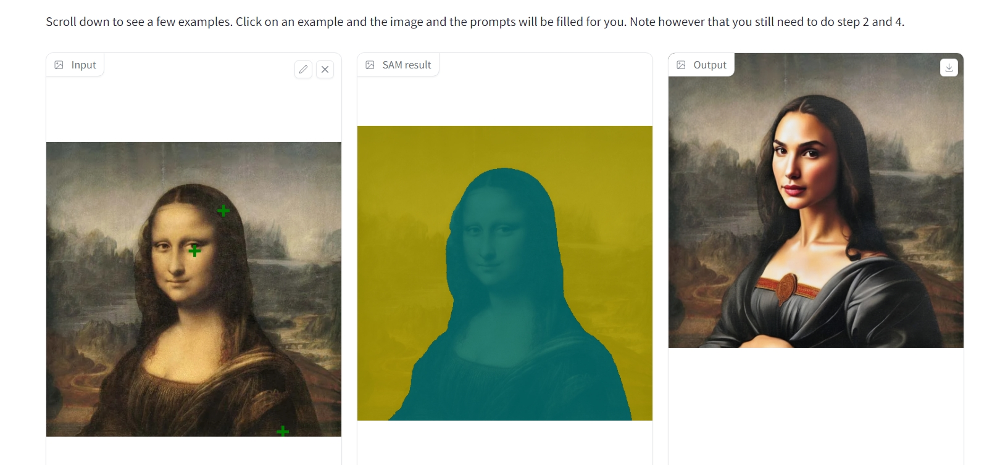
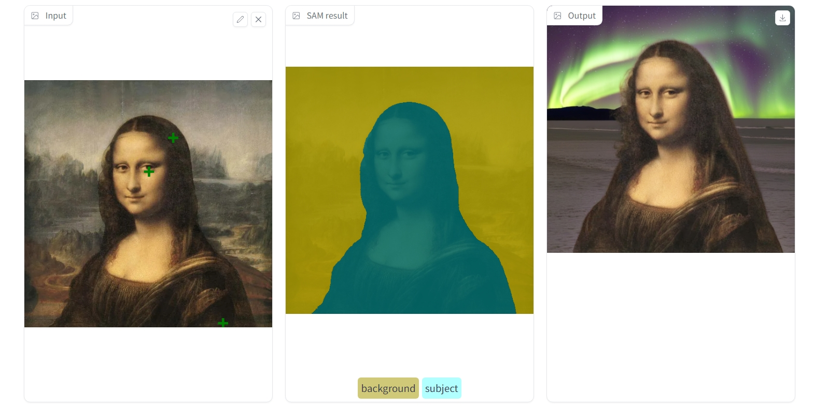
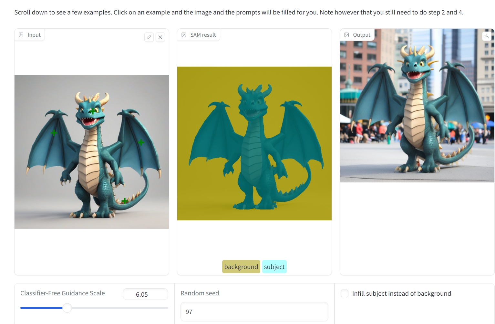
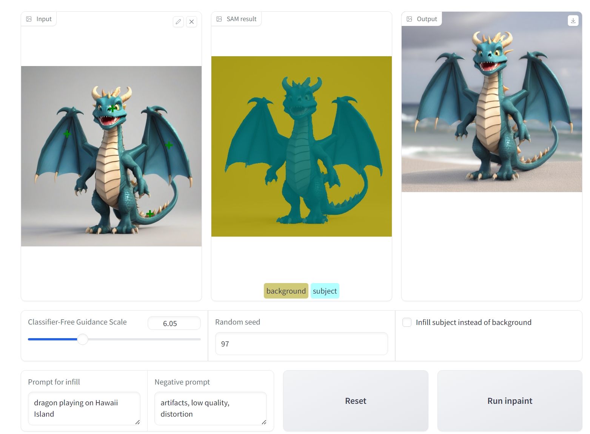

# AI-Photo-Editing-With-Inpainting

---

## About the Project
In this project I have built a little app that allows you to select a subject and then change its background, OR keep the background and change the subject.

The process involves a user uploading an image and selecting the main object by clicking on it. The Segment Anything Model (SAM) is activated to create a mask around the selected object, choosing the most accurate mask generated. The user is shown this result to either accept it or refine the mask further with additional points. Once the mask is finalized, the user gives a text description (and possibly a negative prompt) to specify a new background for the selected object. An infill model then creates this new background, and the final image is displayed. Optionally, the user can choose to invert the mask and substitute the subject while keeping the background, as in the example above.

This little app can be used to swap backgrounds, swap subjects, remove objects, and more!

The code powers the main functionality of the app: calling the SAM model and processing its output, as well as using a text2image diffusion model to generate the new background or subject.

---

## Project Environment

To fully run the project you need to install below libraries in a python environment. 

- pytorch
- transformers
- diffusers
- gradio
- requests
- numpy
- PIL

---

## Results

 

---